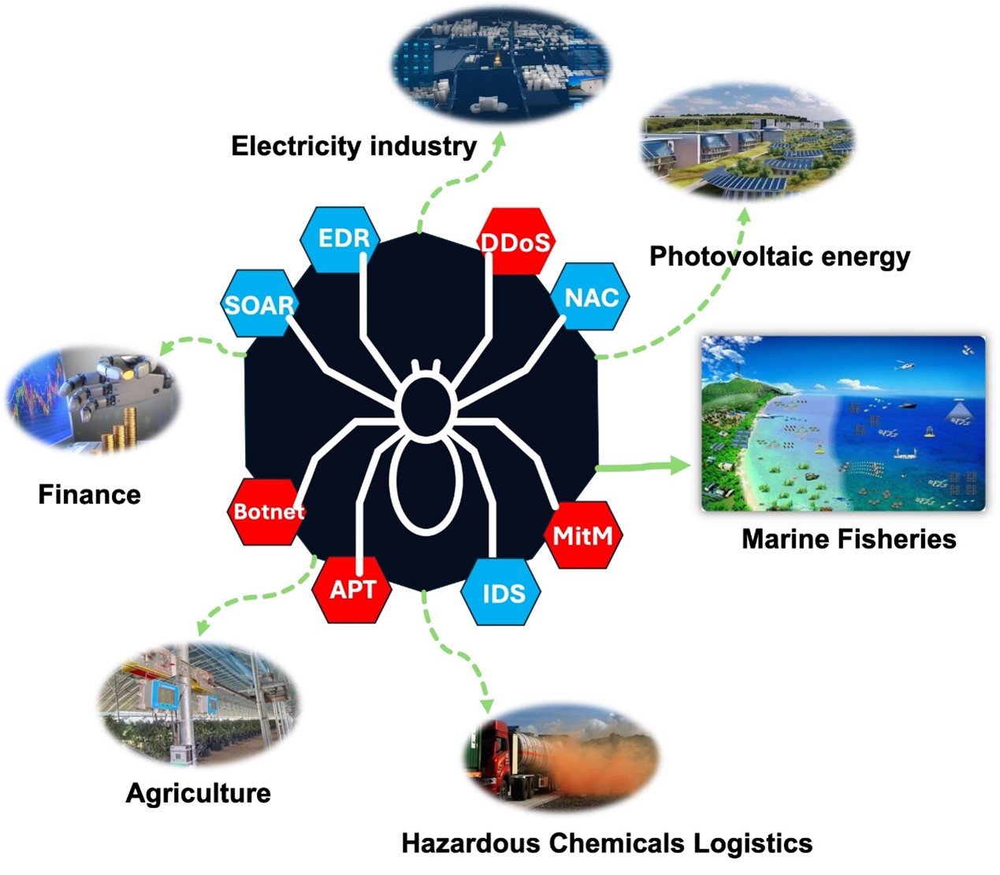
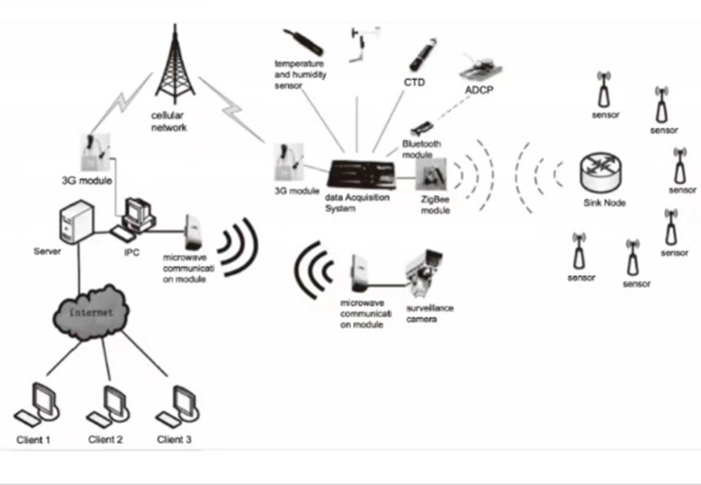
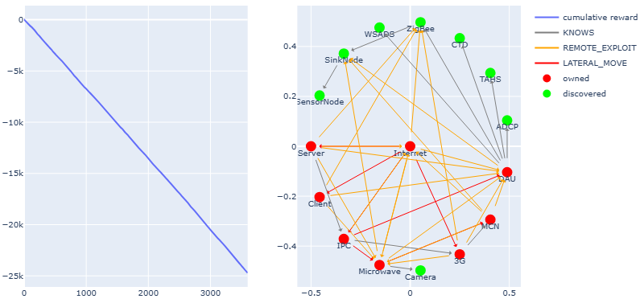
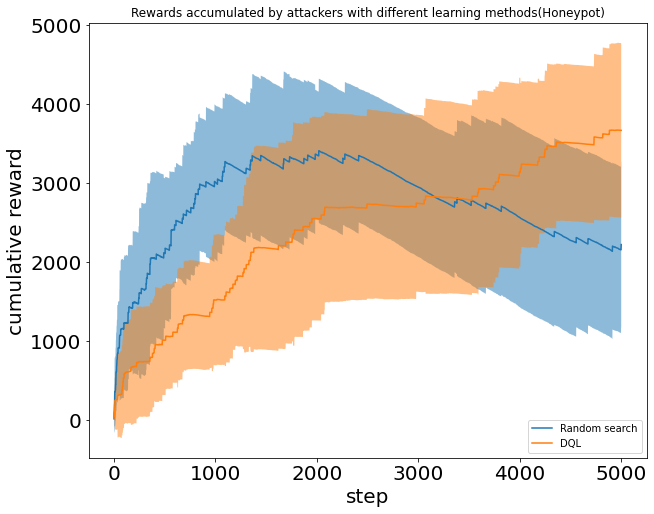
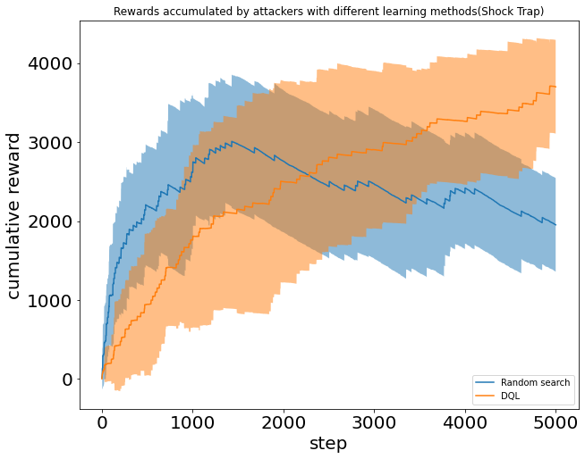

# SpiderSim
## Summary
Welcome to SpiderSim - the Atom-Level Theory Digital Twin Biosimulation Platform. We are dedicated to providing a platform for security professionals to validate the feasibility and effectiveness of theoretical attack and defense techniques. SpiderSim features:

### Flexibility and Efficiency
SpiderSim adopts a lightweight software design and execution framework, unlike traditional simulation platforms, it doesn't require complex virtualized environments. This simplification significantly reduces the threshold for setting up simulation scenarios, allowing users to easily and quickly build simulation environments.

### Atomic-level Attack and Defense Capabilities
SpiderSim supports the construction of complex network attack and defense capabilities using atomic modules. These modules include Shocktrap, Honeypot, Vulnerability Scanner, etc. Users can select the necessary modules to build customized security defense systems or test the effectiveness of individual modules.

### Scalability to Critical Infrastructure Scenarios
SpiderSim offers security simulation modules designed to extend to critical information infrastructure, such as industrial manufacturing, energy, and transportation sectors. These modules provide abstract models of typical system components and communication protocols, facilitating the construction of digital environments for critical infrastructure.

### Evaluation of Active Defense Efficacy
SpiderSim provides theoretical-level simulation capabilities to validate new network security active defense technologies theoretically. We have completed experiments to validate the effectiveness of the Shock Trap defense technology. For more detailed information, please refer to our paper (link).



## Environment Setup Guide
1. Clone the repository:
```python
git https://github.com/NRT2024/SpiderSim.git
cd SpiderSim
```
2. Install dependencies: Recommended Python version: Python 3.10
python版本推荐：python3.10
```python
pip install -r requirements.txt
```

## AI Automation Scene Generation Guide
1. The code related to AI-based scene generation is located in the AI_Scene_Code_Generate directory.
2. To integrate large-scale AI models, the project uses two AI models: Zhipu AI and DeepSeek. Prior to running the project, locate the file:
```python
SpiderSim/AI_Scene_Code_Generate/main.py
```
Add the API for the respective large models in this file, or configure the API key in the environment variables.
3. To run the project:
```python
python SpiderSim/AI_Scene_Code_Generate/main.py
```
This will generate the scene topology code using AI automation. The generated code will be saved in the AI_Code directory as:
```python
AI_Code.json
```
4. To run tests:
```python
cyberbattle/samples/AI_Scene/scene.py
```
This script will utilize the code generated by the large AI models stored in AI_Code.json.
To validate whether the generated code is functioning correctly, run:
```python
notebooks/toyctf-random.ipynb
```
Note: The code generated by the large AI models may contain issues. You can manually inspect and correct any errors before copying the code into the file. Alternatively, you may modify the scene.py script to manually call the generated code.




## Evaluation of Network Attack and Defense Efficacy
1. Create Digital Environment: Abstract actual resources into digital nodes based on the network scenario topology, considering their features such as value and attributes. Use these digital nodes to create a digital twin environment in network simulation tools.

2. Establish Node Dependencies: Based on node attributes and information from neighboring nodes, including vulnerability information, establish dependencies between nodes. These connections can include remote connections and local connections, usually requiring credentials to build communication paths from parent nodes to child nodes.

3. Deploy Network Security Technologies: Deploy network security defense technologies in the environment, such as honeypots and shock traps. Depending on the properties of the technology, configure honeypots as valuable node resources that are actually traps to mislead attackers.

4. Reinforcement Learning of Attacker Agents: Create an attacker agent to attack the network topology. Evaluate the value of breaking each node based on metrics such as the number of attacks and accumulated scores.

5. Evaluate the Effectiveness of Network Security Technologies: Compare the total value obtained by attackers or standards under specific conditions, such as when the attacker's cumulative reward reaches a certain value or the number of attack steps. These evaluation results are used to determine the effectiveness of different defense effects and provide guidance for the deployment of network security technologies.

## Case Study
We used SpiderSim to theoretically validate the defense effects of honeypots, shock traps, and other techniques. The figure below shows the validation of honeypot technology in our paper. See the toy_ctf.py file for related code.
Evaluation Steps:
1. Follow the scenario deployment guide to deploy the corresponding scenarios using the toy_ctf.py provided code.
2. Abstract the defense technology according to the code below. In this example, we set the value parameter to -100, indicating a negative reward value for the defense technology. Normal resource node value is +1000. Node values can be customized according to node value. See the toy_ctf.py file for more details.

```python
'Honeypot': m.NodeInfo(
     services=[m.ListeningService("HTTPS")],
     value=-100,
     properties=["GitHub", "SasUrlInCommit"],
     vulnerabilities=dict(
         ScanGitHistory=m.VulnerabilityInfo(
             description="Some secure access token (SAS) leaked in a reverted git commit",
             type=m.VulnerabilityType.REMOTE,
             precondition=m.Precondition('SasUrlInCommit&GitHub'),
             outcome=m.LeakedCredentials(credentials=[
                         m.CachedCredential(node="AzureStorage",
                                                 port="HTTPS",
                                                 credential="SASTOKEN")]), # error credentials
             reward_string="CredScan success: Some secure access token (SAS) was leaked in a reverted git commit",
             cost=1.0,))),
```
The placement of defense techniques is determined by the pre and post-vulnerabilities, with specific locations determined by the vulnerabilities parameter. For example, in the toy_ctf.py code, the placement of honeypots can be set before the AzureStorage node and after the website node. Based on the characteristics of honeypot technology, provide false credentials connecting to the AzureStorage node on the basis of vulnerabilities contained in the honeypot node. After completing this step, the defense technology is deployed.

3. Run the provided notebook_random_dql.ipynb code, which uses random attacker agents and DQL attacker agents. This will generate the honeypot defense effect graph as shown below. Compare the change trends of the curves in the graph based on the cumulative reward on the y-axis and the number of steps on the x-axis to verify the defense effect of the defense technology.




## Changelog
### v0.1 - ShockTrap Defense Technology Validation
- Implemented validation of active defense technologies including Honeypot, Honeytokens, and ShockTrap.
### v0.2 - Smart Ocean Scene Deployment
- Completed the initial deployment of the Smart Ocean scene, including the implementation of core functionalities and environmental simulation.
### v2.0 - Introduction of AI-based Automated Scene Generation
- Integrated AI models to support automated generation of ocean environment scenes.
- Introduced adaptive scene optimization to improve efficiency and quality of scene generation.
- Enhanced the interactivity and adjustment features for AI-generated scenes, providing more flexible scene customization.

## Contribution Guidelines
Thank you for considering contributing to SpiderSim! We welcome all forms of contribution, including bug reports, suggestions, documentation improvements, code submissions, etc. Your contribution helps us improve the project and make it more powerful.

### Reporting Issues
If you encounter any issues while using SpiderSim or find any bugs, please report them to us. You can report issues via the following methods:
- Submit an issue on GitHub.
- Send an email to our contact email.
When reporting issues, please provide as much detail as possible, including a description of the issue, steps to reproduce, and relevant environment information.

### Submitting Suggestions and Improvements
We welcome any suggestions and improvement ideas related to the project. You can share your ideas via the following methods:
- Submit a feature request on GitHub.
- Send us an email to share your suggestions.

### Submitting Code
If you'd like to contribute code to the project, we greatly appreciate your participation. You can submit code contributions via the following steps:
- Fork the project repository and create your own branch.
- Make modifications and improvements on your branch.
- Submit a Pull Request to the main project repository.
Before submitting a Pull Request, please ensure that your code complies with the project's coding standards and includes relevant documentation and tests. We will review your code as soon as possible and communicate any necessary improvements.

### Contact US
If you have any questions or need assistance, please feel free to contact us. You can reach us via the following methods:

- Leave a message on the issues page on GitHub.
- Send an email to our contact email.
Thank you for your contribution and support!
